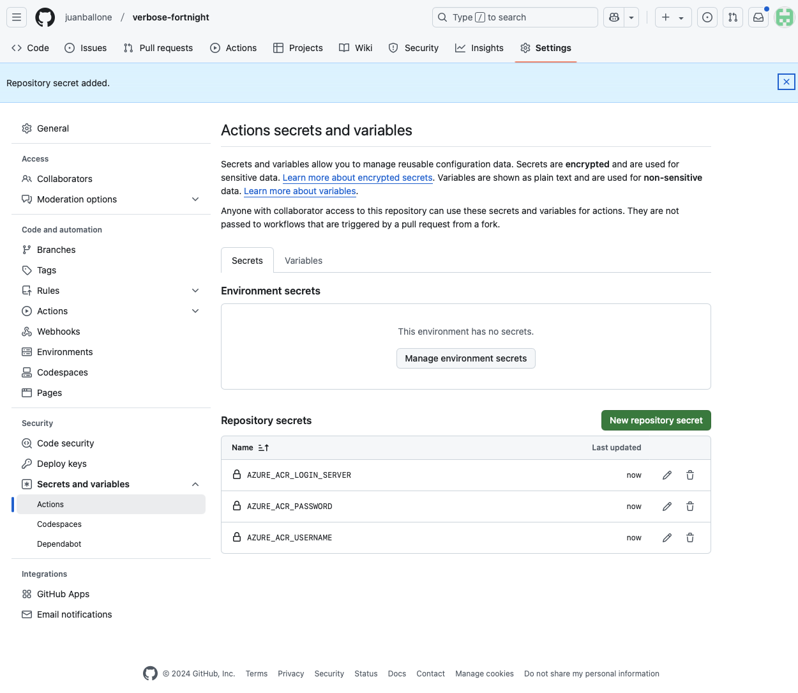
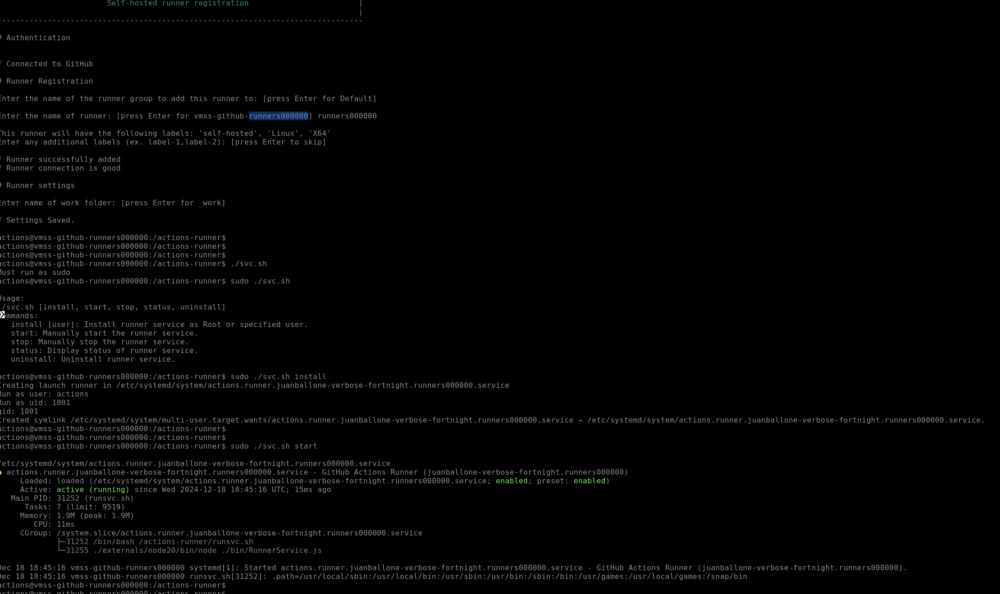

# Cloud Prerequisites for Azure Deployment

To set up a CI/CD pipeline for deploying on Azure, the following prerequisites must be in place:

## 1. **Service Principal with Federated Token **
- **Purpose**: To authenticate Terraform against Azure using a federated token for secure, passwordless authentication.
- **Steps**:
  1. Create a Service Principal:
     ```bash
     az ad sp create-for-rbac --name terraform-sp-client --role Owner \
     --scopes /subscriptions/<subscription-id> \
     --sdk-auth
     ```
     Replace `<subscription-id>` with your Azure subscription ID.
  2. Note the output JSON for use in GitHub Secrets.

- **Permissions**: Assign the **Owner** role to the Service Principal at the subscription level.

## 2. **Assign Owner Role in the Subscription**
- **Purpose**: Allows the Service Principal to manage resources in the Azure subscription.
- **Steps**:
  1. Navigate to Azure Portal.
  2. Go to **Subscriptions** > Select your subscription.
  3. Click **Access Control (IAM)** > **Add Role Assignment**.
  4. Assign the **Owner** role to the created Service Principal.

## 3. **Azure Container Registry (ACR)**
- **Purpose**: To store Docker images for deployment.
- **Steps**:
  1. Create an Azure Container Registry:
     ```bash
     az acr create --name <acr-name> --resource-group <resource-group> \
     --sku Basic --admin-enabled true
     ```
  2. Replace `<acr-name>` and `<resource-group>` with your preferred names.

- **Notes**:
  - Ensure the Service Principal has `AcrPush` and `AcrPull` roles for the registry.

## 4. **Azure Storage Account**
- **Purpose**: To store Terraform state files securely.
- **Steps**:
  1. Create a Storage Account:
     ```bash
     az storage account create --name <storage-account-name> \
     --resource-group <resource-group> --location <location> --sku Standard_LRS
     ```
  2. Create a Storage Container:
     ```bash
     az storage container create --account-name <storage-account-name> --name terraform-state
     ```
  3. Retrieve the storage account key for Terraform configuration:
     ```bash
     az storage account keys list --account-name <storage-account-name> --query [0].value -o tsv
     ```

## 5. **GitHub Secrets**
- **Purpose**: To securely store sensitive information required for the CI/CD pipeline.
- **Required Secrets**:
  - `AZURE_CLIENT_ID`: From the Service Principal.
  - `AZURE_CLIENT_SECRET`: From the Service Principal.
  - `AZURE_TENANT_ID`: From the Service Principal.
  - `AZURE_SUBSCRIPTION_ID`: Azure subscription ID.
  - `AZURE_ACR_LOGIN_SERVER`: ACR login server name.
  - `AZURE_ACR_USERNAME`: ACR username.
  - `AZURE_ACR_PASSWORD`: ACR password (retrieved from ACR admin credentials).

- **Steps**:
  1. Navigate to your GitHub repository.
  2. Go to **Settings** > **Secrets and variables** > **Actions**.
  3. Add the above secrets one by one.




## 6. **Deploy and Create a Self-Hosted Runner on Azure**
- **Purpose**: To run the CI/CD pipeline jobs on a self-hosted GitHub Actions runner deployed on Azure.
- **Steps**:
  1. Follow GitHub’s instructions to deploy a self-hosted runner on Azure:
     - [GitHub Actions Self-Hosted Runner Documentation](https://docs.github.com/en/actions/hosting-your-own-runners)
  2. Deploy a VM or containerized environment for the runner:
     ```bash
     az vm create --name <vm-name> --resource-group <resource-group> --image UbuntuLTS \
     --admin-username <username> --generate-ssh-keys
     ```
  3. Install the GitHub Actions Runner software on the VM.
  4. Configure the runner to connect to your GitHub repository.
  5. Take a look at [clout-init-config.yaml](files/clout-init-config.yaml), it is important to install all dependencies.



- **Notes**:
  - Ensure the VM has network access to Azure resources and GitHub.
  - Use a managed identity for secure authentication if possible.

## References
- [GitHub Actions Documentation](https://docs.github.com/en/actions)
