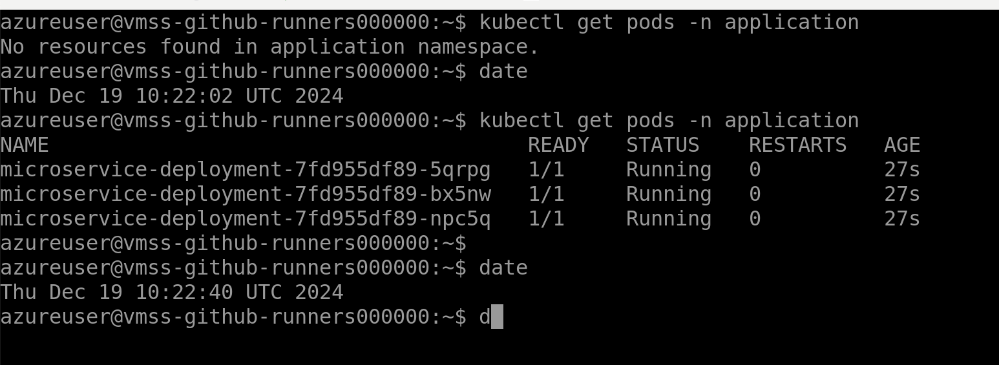

# Deployment Progress

## Introduction
This document outlines the deployment process of an Azure Kubernetes Cluster using Terraform and GitHub Actions, as well as the steps to deploy an application onto the cluster using Flux. It also highlights encountered issues, testing processes, and areas for improvement.

## IMPORTANT
Before proceeding, ensure you have reviewed the document [**Cloud Prerequisites for Azure Deployment**](Cloud%20Prerequisites%20for%20Azure%20Deployment.md), as it contains key elements necessary for a successful setup.

## Azure Kubernetes Cluster Creation
This section describes the creation of the Azure Kubernetes Cluster using Terraform. 

### Prerequisites
- Ensure the GitHub Actions runner is registered and operational.
- Azure credentials are set up in GitHub secrets.

### Terraform Configuration
Terraform will provision the following resources:
- Azure Kubernetes Cluster
- Network
- Managed Identities
- RBAC permissions
- Peering to the runner’s network

#### Terraform Module: `kubernetes-baseline-configuration`
This module deploys key components to facilitate application deployment:
- **Flux:** Automates deployments from a Git repository.
- **Cert-Manager:** Manages TLS certificates.
- **External-DNS:** Updates DNS records for Kubernetes ingress.
- **NGINX:** Acts as an ingress controller.

#### Deployment Process
1. Initialize and apply the Terraform configuration. NOTE this will be done by the [workflow](./github/workflows/terraform.yaml)
   ```bash
   terraform init
   terraform apply
   ```
2. Monitor the cluster creation progress.


## Application Deployment by Flux
Flux monitors a Git repository and deploys applications based on YAML configurations.

### Deployment Steps
1. Configure Flux to sync with the repository and path containing YAML files.
2. Verify that the namespace is initially empty.
3. Observe the deployment of the application onto the Kubernetes cluster.



### Troubleshooting Tips
- Ensure the repository URL and credentials are correctly configured.
- Validate Flux logs for any errors during synchronization.

## Terraform Dependency Issue
An issue was encountered during the Terraform deployment phase.

### Description
The following error occurred:


### Root Cause
Dependency conflicts between modules resulted in the failure.

### Suggested Fixes
- Investigate module versions and upgrade or pin dependencies.
- Run `terraform plan` to identify conflicting resources.

## Testing
Testing is essential to validate the successful deployment of the application.

### Process
1. Run the CI/CD pipeline to test the deployment.
2. Validate application functionality and connectivity.


## Further Improvements
- **Fix the Terraform Dependency Issue:**
  - Review and update module versions.
  - Refactor Terraform configurations to reduce interdependencies.
- **Enhance Documentation:**
  - Add detailed descriptions of the Kubernetes components (Flux, Cert-Manager, External-DNS, NGINX).
  - Include configuration examples for these components.
- **Expand Testing:**
  - Automate end-to-end testing of the application and infrastructure.

## References
- [GitHub Actions Documentation](https://docs.github.com/en/actions)
- [Terraform Documentation](https://registry.terraform.io/)
- [Kubernetes Documentation](https://kubernetes.io/)

